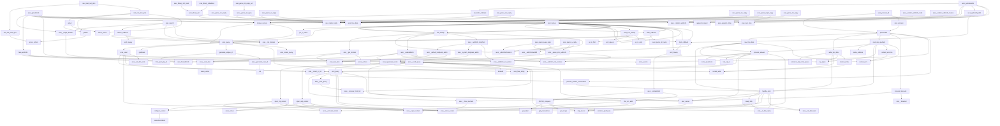

```mermaid
  graph TD;
ares__readaddrinfo --> ares__read_line;
ares__readaddrinfo --> ares_append_ai_node;
ares__readaddrinfo --> ares__addrinfo_cat_nodes;
ares__readaddrinfo --> ares__addrinfo_cat_cnames;
ares__readaddrinfo --> ares_inet_pton;
ares__get_hostent --> ares__read_line;
ares__get_hostent --> ares_inet_pton;
ares__get_hostent --> aresx_uztoss;
inet_net_pton_ipv4 --> aresx_sztosi;
inet_net_pton_ipv6 --> getv4;
inet_net_pton_ipv6 --> getbits;
inet_net_pton_ipv6 --> aresx_sztoui;
ares_getaddrinfo --> ares__single_domain;
ares_getaddrinfo --> fake_addrinfo;
ares_getaddrinfo --> lookup_service;
ares_getaddrinfo --> next_lookup;
ares_getaddrinfo --> next_lookup;
ares_getaddrinfo --> lookup_service;
ares_getaddrinfo --> ares_freeaddrinfo;
ares_getaddrinfo --> ares__malloc_addrinfo;
open_tcp_socket --> configure_socket;
open_tcp_socket --> ares__connect_socket;
open_tcp_socket --> ares__open_socket;
open_tcp_socket --> ares__close_socket;
open_tcp_socket --> aresx_sitous;
ares_getnameinfo --> nameinfo_callback;
ares_getnameinfo --> lookup_service;
ares_getnameinfo --> append_scopeid;
ares_getnameinfo --> ares_gethostbyaddr;
ares_getnameinfo --> lookup_service;
ares_getnameinfo --> ares_inet_ntop;
open_udp_socket --> configure_socket;
open_udp_socket --> ares__connect_socket;
open_udp_socket --> ares__open_socket;
open_udp_socket --> ares__close_socket;
open_udp_socket --> aresx_sitous;
ares__single_domain --> ares__read_line;
ares__send_query --> open_tcp_socket;
ares__send_query --> open_udp_socket;
ares__send_query --> end_query;
ares__send_query --> next_server;
ares__send_query --> socket_write;
ares__send_query --> timeadd;
ares__send_query --> ares__remove_from_list;
ares__send_query --> skip_server;
ares__send_query --> ares__insert_in_list;
fake_addrinfo --> ares_append_ai_node;
fake_addrinfo --> ares_freeaddrinfo;
fake_addrinfo --> ares_inet_pton;
ares_search --> ares__single_domain;
ares_search --> search_callback;
ares_search --> ares_query;
ares_search --> ares__cat_domain;
ares_send --> ares__send_query;
ares_send --> end_query;
ares_send --> ares__tvnow;
ares_send --> skip_server;
ares_send --> ares__insert_in_list;
ares_send --> ares__init_list_node;
read_tcp_data --> process_answer;
read_tcp_data --> handle_error;
read_tcp_data --> try_again;
read_tcp_data --> socket_recv;
rfc6724_compare --> get_label;
rfc6724_compare --> get_precedence;
rfc6724_compare --> get_scope;
rfc6724_compare --> common_prefix_len;
nameinfo_callback --> lookup_service;
nameinfo_callback --> append_scopeid;
nameinfo_callback --> lookup_service;
nameinfo_callback --> ares_inet_ntop;
process_answer --> ares__send_query;
process_answer --> same_questions;
process_answer --> has_opt_rr;
process_answer --> end_query;
process_answer --> next_server;
process_answer --> skip_server;
write_tcp_data --> advance_tcp_send_queue;
write_tcp_data --> handle_error;
write_tcp_data --> socket_write;
write_tcp_data --> try_again;
write_tcp_data --> socket_writev;
has_opt_rr --> ares_free_string;
next_dns_lookup --> host_callback;
next_dns_lookup --> ares_query;
next_dns_lookup --> as_is_first;
next_dns_lookup --> ares__cat_domain;
next_dns_lookup --> as_is_only;
read_udp_packets --> process_answer;
read_udp_packets --> same_address;
read_udp_packets --> handle_error;
read_udp_packets --> try_again;
read_udp_packets --> socket_recvfrom;
read_udp_packets --> socket_recv;
configure_socket --> setsocknonblock;
lookup_service --> lookup_service;
file_lookup --> ares__get_hostent;
file_lookup --> file_lookup;
file_lookup --> ares__readaddrinfo;
file_lookup --> file_lookup;
file_lookup --> ares__addrinfo_localhost;
find_src_addr --> ares__connect_socket;
find_src_addr --> ares__open_socket;
find_src_addr --> ares__close_socket;
search_callback --> ares_query;
search_callback --> ares__cat_domain;
search_callback --> end_squery;
host_callback --> end_hquery;
host_callback --> next_lookup;
host_callback --> next_lookup;
host_callback --> ares__parse_into_addrinfo;
ares__sortaddrinfo --> rfc6724_compare;
ares__sortaddrinfo --> find_src_addr;
getv4 --> getbits;
getv4 --> aresx_sztoui;
end_query --> ares__close_sockets;
end_query --> ares__free_query;
end_query --> process_broken_connections;
end_query --> ares__close_socket;
end_query --> ares__is_list_empty;
ares__read_line --> aresx_uztosi;
ares_gethostbyaddr --> host_callback;
ares_gethostbyaddr --> next_lookup;
ares_gethostbyaddr --> next_lookup;
ares__close_sockets --> ares__close_socket;
ares__addrinfo_localhost --> ares__default_loopback_addrs;
ares__addrinfo_localhost --> ares__system_loopback_addrs;
ares__addrinfo_localhost --> ares__addrinfo_cat_nodes;
end_hquery --> ares__sortaddrinfo;
end_hquery --> ares_freeaddrinfo;
next_lookup --> file_lookup;
next_lookup --> file_lookup;
next_lookup --> ptr_rr_name;
next_lookup --> ares_query;
next_lookup --> addr_callback;
next_lookup --> next_lookup;
next_lookup --> end_aquery;
ares_query --> ares_send;
ares_query --> qcallback;
ares_query --> generate_unique_id;
ares_query --> ares_free_string;
ares_query --> ares_create_query;
getbits --> aresx_sztosi;
addr_callback --> next_lookup;
addr_callback --> next_lookup;
addr_callback --> ares_parse_ptr_reply;
addr_callback --> end_aquery;
next_lookup --> next_dns_lookup;
next_lookup --> file_lookup;
next_lookup --> file_lookup;
next_lookup --> end_hquery;
next_lookup --> next_lookup;
ares__default_loopback_addrs --> ares_append_ai_node;
ares__default_loopback_addrs --> ares_inet_pton;
ares__parse_into_addrinfo --> ares_append_ai_node;
ares__parse_into_addrinfo --> ares__addrinfo_cat_nodes;
ares__parse_into_addrinfo --> ares__addrinfo_cat_cnames;
process_timeouts --> next_server;
process_timeouts --> ares__timedout;
swap_lists --> ares__init_list_head;
swap_lists --> ares__is_list_empty;
lookup_service --> lookup_service;
ares_parse_caa_reply --> ares_malloc_data;
ares_parse_caa_reply --> ares_free_data;
handle_error --> ares__close_sockets;
handle_error --> swap_lists;
handle_error --> next_server;
handle_error --> skip_server;
handle_error --> ares__close_socket;
handle_error --> ares__init_list_head;
handle_error --> ares__is_list_empty;
next_server --> ares__send_query;
next_server --> end_query;
next_server --> skip_server;
ares_inet_net_pton --> inet_net_pton_ipv4;
ares_inet_net_pton --> inet_net_pton_ipv6;
ares__free_query --> ares__remove_from_list;
process_broken_connections --> handle_error;
ares__parse_txt_reply --> ares_malloc_data;
ares__parse_txt_reply --> ares_free_data;
ares_parse_uri_reply --> ares_malloc_data;
ares_parse_uri_reply --> ares_free_data;
ares_library_init_mem --> ares_library_init;
processfds --> read_tcp_data;
processfds --> write_tcp_data;
processfds --> read_udp_packets;
processfds --> process_timeouts;
processfds --> ares__tvnow;
processfds --> process_broken_connections;
socket_recvfrom --> socket_recv;
ares__system_loopback_addrs --> ares_append_ai_node;
generate_unique_id --> find_query_by_id;
generate_unique_id --> ares__generate_new_id;
ares_parse_soa_reply --> ares_malloc_data;
ares_parse_soa_reply --> ares_free_data;
socket_writev --> socket_write;
ares__generate_new_id --> rc4;
ares_parse_srv_reply --> ares_malloc_data;
ares_parse_srv_reply --> ares_free_data;
ares_parse_naptr_reply --> ares_malloc_data;
ares_parse_naptr_reply --> ares_free_data;
ares_parse_naptr_reply --> ares_expand_string;
ares_parse_mx_reply --> ares_malloc_data;
ares_parse_mx_reply --> ares_free_data;
ares_library_initialized --> ares_library_init;
ares_process --> processfds;
ares_process_fd --> processfds;
ares_process_fd --> ares_process;
ares_parse_aaaa_reply --> ares__addrinfo2hostent;
ares_parse_aaaa_reply --> ares__parse_into_addrinfo;
ares_parse_aaaa_reply --> ares__addrinfo2addrttl;
ares_parse_a_reply --> ares__addrinfo2hostent;
ares_parse_a_reply --> ares__parse_into_addrinfo;
ares_parse_a_reply --> ares__addrinfo2addrttl;
ares_parse_txt_reply_ext --> ares__parse_txt_reply;
ares__malloc_addrinfo_node --> ares__malloc_addrinfo;
ares__malloc_addrinfo_cname --> ares__malloc_addrinfo;
```
